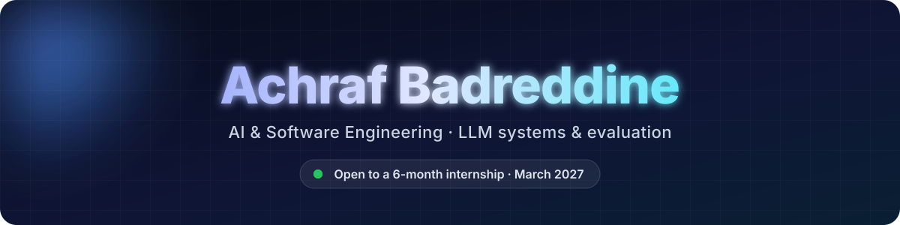

<div align="center">



<a href="https://github.com/achraf-hh"></a>

<a href="https://www.linkedin.com/in/achraf-badreddine/"></a>
<a href="mailto:badreddineachraf03@gmail.com"></a>
<a href="https://github.com/achraf-hh/notestream"></a>

</div>

## 🎯 About me

```python
achraf = {
    "role": "Final-year CS engineering student",
    "schools": ["Mines Saint-Étienne", "INPT Rabat"],
    "focus": ["LLM systems", "evaluation", "retrieval", "backend engineering"],
    "last_internship": "AI Engineering Intern @ Hellebore Technologies (2026)",
    "looking_for": "6-month end-of-studies internship from March 2027",
    "speaks": ["Arabic", "French", "English"],
}
```

- 🔬 At **Hellebore Technologies**, I ran a feasibility study on extracting the 22 fields of credit-derivatives trades from bank emails with a local LLM, fully on-premise: **97.3% precision, 98.3% recall** on a ground-truth set
- 🧪 Built the evaluation harness that steered an AI coding agent writing a model-free email splitter; it caught the first version overfitting (**100%** on seen senders, **55.4%** on a held-out one)
- ⚖️ Compared 3 local and 5 hosted models: the choice of model mattered about **10× less** than the pipeline around it
- ⚡ Shipped an internal AI agent serving **500+ requests/day**

## 🚀 Featured projects

| Project | What it is | Stack |
|---|---|---|
| [**NoteStream**](https://github.com/achraf-hh/notestream) | Self-hosted document Q&A: ingest, embed and retrieve over **5,000+ chunks**, answers with citations | Java · Spring Boot · Python · FastAPI · PostgreSQL/pgvector · Docker |
| **BioGas Scout AI** | Team project: retrieval over **10,000+ pages** of European biogas documents; I led architecture and deployment on a self-hosted Linux server | RAGFlow · Docker · Linux · Python |

## 💼 Experience

- **Hellebore Technologies**, AI Engineering Intern (2026): a natural-language interface to the company's API (two-stage retrieval over pgvector, demoed to the whole company), then a local-LLM extraction study run fully on-premise, where I cut a 1,000-email run from 12h to 4h across two GPUs
- **ATMView**, Software Engineering Intern (2025): shipped a CRM-integrated AI agent end to end, from training to internal REST deployment
- **ATMView**, Software Engineering Intern (2024): built fraud-detection pipelines and a role-based internal web application for 50+ users

## 🛠️ Tech stack

<p align="center">
  
</p>

<p align="center">
  
  
  
  
  
  
  
</p>
